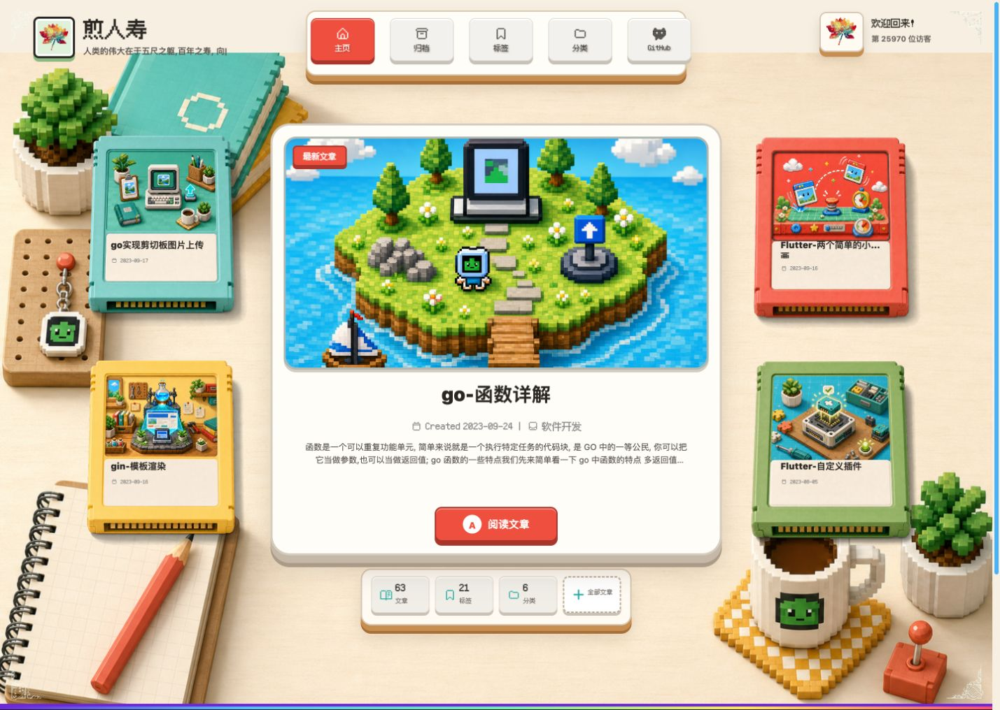

# Hexo Theme Toybox

[](https://github.com/DipsySu/hexo-theme-toybox/actions/workflows/ci.yml)
[](https://dipsysu.github.io/hexo-theme-toybox/)
[](LICENSE)
[](https://hexo.io/)

Toybox 是一个独立维护的 Hexo 像素掌机主题。它提供卡带式首页、文章手册、
随机 Sprite 彩蛋、本地搜索，以及运行时的浅色/深色/自动配色和三语言界面。



[打开在线 Demo](https://dipsysu.github.io/hexo-theme-toybox/)

主题所需的布局、样式、脚本、字体、光标和图片都包含在仓库中，不需要向站点
`source` 目录复制额外文件。

## 功能

- 卡带式首页、键盘切换与分页过渡
- 随机像素 Sprite 彩蛋
- 文章目录、阅读模式、上一篇/下一篇与相关推荐
- 归档、标签、分类、友情链接和 404 页面
- 本地搜索、图片懒加载、Fancybox 和 Share.js
- Light / Dark / Auto 配色
- English / 简体中文 / 繁体中文界面

## 安装

在 Hexo 站点根目录运行：

```bash
git clone --depth=1 https://github.com/DipsySu/hexo-theme-toybox.git themes/toybox
npm install hexo-renderer-pug hexo-renderer-stylus
```

然后在站点 `_config.yml` 中启用主题：

```yml
theme: toybox
```

本地搜索需要额外安装 `hexo-generator-searchdb`；文章字数功能需要
`hexo-wordcount`。未安装时请保持对应选项关闭。

## 配置

将主题的 `_config.yml` 复制为站点根目录 `_config.toybox.yml`，以后只修改站点
覆盖文件，更新主题时就不会覆盖你的配置。

```yml
local_search:
  enable: true
  preload: true

wordcount:
  enable: true

toybox:
  settings:
    enable: true
    color_mode:
      default: auto # light / dark / auto
    locale:
      default: zh-CN # en / zh-CN / zh-TW
```

头像、站点图标和菜单可以通过 `avatar`、`favicon`、`nav` 与 `menu` 配置覆盖。

## 更新

```bash
git -C themes/toybox pull --ff-only
```

更新前请确认个性化配置都保存在站点根目录 `_config.toybox.yml`。

## 功能边界

Toybox 不内置评论系统、聊天、广告、播放器、数学公式、PWA 或 PJAX。这些能力
需要时应作为站点级扩展接入，避免主题重新变成臃肿的集成包。

## 开发

```bash
npm install
npm test
npm pack --dry-run
```

完整页面需要将本仓库放到 Hexo 站点的 `themes/toybox` 后运行站点构建。
提交改动前请阅读 [CONTRIBUTING.md](CONTRIBUTING.md)。

仓库内置了一套不含个人内容的 Pages 示例站：

```bash
npm ci --prefix demo
npm run build --prefix demo
```

构建结果位于 `demo/public`。`main` 分支更新后，GitHub Actions 会自动重新部署
在线 Demo。

## 许可与致谢

Toybox 使用 [Apache-2.0](LICENSE) 许可证。主题早期基于
[Hexo Theme Butterfly](https://github.com/jerryc127/hexo-theme-butterfly) 的
Apache-2.0 代码演进而来，相关署名见 [NOTICE](NOTICE)。Pixelarticons 图标许可见
`source/img/pixel-icons/LICENSE`，Fusion Pixel 字体许可见
`source/fonts/LICENSE-Fusion-Pixel-OFL.txt`。
